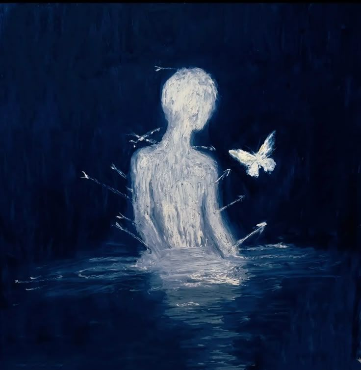

**My New repository**
My New repository

[print](https://github.com/muhitmaruf/Infinite-maruf)


<p align="center">
  
</p>

<p align="center">
  
</p>


# My Demo Project This is a small interactive HTML + CSS demo page. It includes:
 - Dark mode toggle 🌙
  - Greeting form 👋
   - Animated card 🎴 
   ## 🚀 How to use 1. Clone the repo: 
   ```bash git clone 
   https://github.com/muhitmaruf/Infinite-maruf?💕


# Bold
** Now iam working github **

## Italic
** resone i am felling good **

